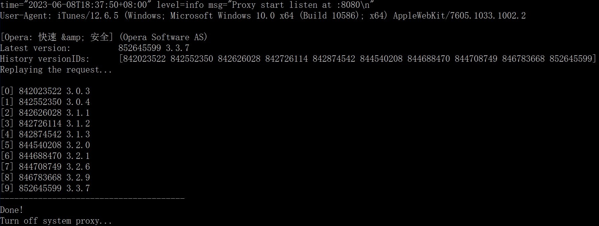
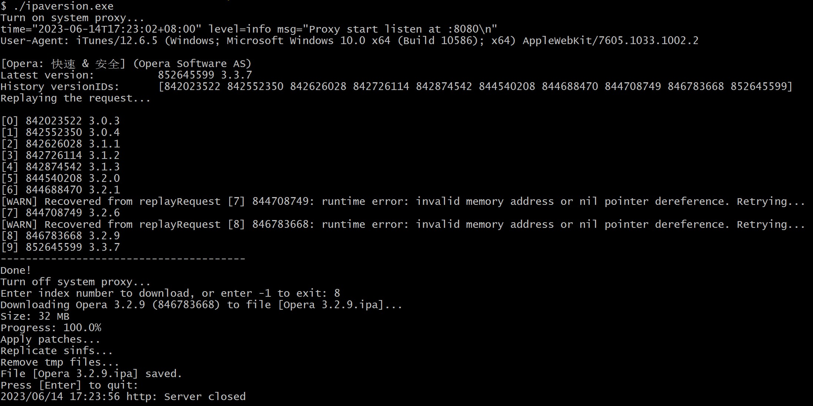

# ipaversion

MITM utility for querying & downloading history versions of iOS apps.

- Query history versions




- Select one to download




## prerequisites

1. Install **iTunes 12.6.5** , login Apple ID, and trust & authorize the computer you are using.

   - macOS: https://secure-appldnld.apple.com/itunes12/091-87821-20180912-69177170-B085-11E8-B6AB-C1D03409AD2A/iTunes12.6.5.dmg
   - Windows: https://secure-appldnld.apple.com/itunes12/091-87819-20180912-69177170-B085-11E8-B6AB-C1D03409AD2A6/iTunes64Setup.exe

2. Download `ipaversion` from [Releases](./releases) page.

3. Generate your own CA cert and put into `~/.mitmproxy` , **OR** just start `ipaversion` and it will generate a new one.

4. Trust the CA cert. (Read mitmproxy docs [About Certificates](https://docs.mitmproxy.org/stable/concepts-certificates/) for more information)

   - macOS

   ```shell
   sudo security add-trusted-cert -d -p ssl -p basic -k /Library/Keychains/System.keychain ~/.mitmproxy/mitmproxy-ca-cert.pem
   ```

   - Windows

   ```shell
   certutil -addstore root mitmproxy-ca-cert.cer
   ```

Now you are ready to GO!


## usage

1. Quit `ipaversion` if it is open. Run `ipaversion -c` to make sure it turns off the system proxy.
2. Open iTunes, search for an App. Buy it if you haven't.
3. Start `ipaversion` 
4. Go back to iTunes and click Download button.
5. `ipaversion` will intercept the request and use it to get history versions.

> **Note:** By default, `ipaversion` will get *all* history versions. If you only want to query a subset of those versions, specify `-start` and/or `-end` flags:
>
> ```shell
> # query a given range of versions: versionIDs[10..20)
> ipaversion -start 10 -end 20
> # query first(oldest) 5 versions: versionsIDs[0..5)
> ipaversion -end 5
> 
> # A negative value means counting from last, for example:
> # query last(latest) 5 versions
> ipaversion -start -5
> ```


## help

```shell
$ ipaversion -h
Usage: ipaversion [options]
options
  -c    cleanup and exit. (e.g. turn off proxy)
  -dump
        dump responses to files
  -end int
        versionIDs index range [start, end) (default 9223372036854775807)
  -h    show help and exit
  -i string
        read the input file and download ipa
  -ps
        show current system proxy status
  -s    do not set system proxy
  -start int
        versionIDs index range [start, end)
  -v    show version
```


## features

- [x] Set system proxy when starting `ipaversion` , and turn off proxy upon normal quitting.
- [x] Add `-c` option for cleanup. (e.g. turn off system proxy)
- [x] Add `-s` option: do not set system proxy.
- [x] Query a given range of the history versions.
- [x] Enter index number to download `ipa` file.


## thanks

- [mitmproxy](https://mitmproxy.org/) An interactive TLS-capable intercepting HTTP proxy for penetration testers and software developers.
- [go-mitmproxy](https://github.com/lqqyt2423/go-mitmproxy) mitmproxy implemented with golang.
- [sysproxy](https://github.com/lixvbnet/sysproxy) Go library and CLI tool for setting system proxy.

